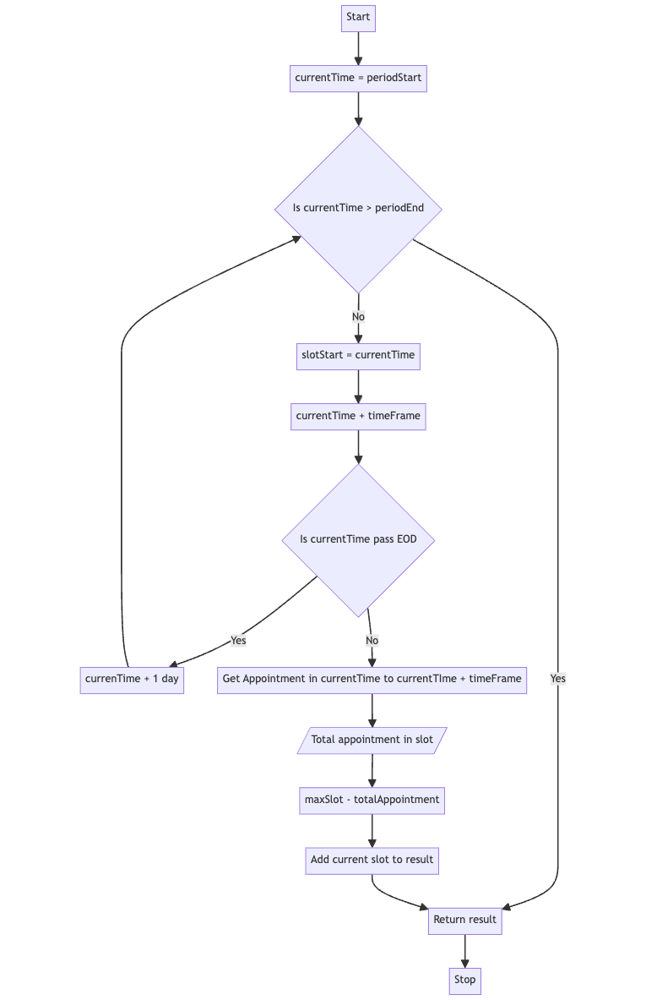

## Simple Appointment System

### Get available Slot Logic

The main logic is to generate slot by adding time frame (for example 30 minutes) in a loop until the end period. And in every loop, check total appointment and reduce it from max slot configured.
The assumption is when the time frame configuration changed, and somehow the total appointment exceed the slot configured, the available slot who is currently negative, automatically set to 0

### How to start

- Copy `.env.example` file with command `cp .env.example .env` and change the value based on your configuration
- Run `yarn install` or `npm install`
- Run `yarn migrate:run` or `npm run migrate:run`
- Run `yarn start:dev` or `npm run start:dev`
- For production, run `yarn build` then `yarn start`

### Configuration

Configuration can be set in `.env` file
These are the app configurations:

- `MAX_APPOINTMENT_SLOT`: Total maximum appointment in one time slot
- `TIME_FRAME_IN_MINUTE`: One time slot duration
- `OPERATIONAL_START_HOUR`: Starting hour for each day
- `OPERATIONAL_END_HOUR`: End time for each day
- `OPERATIONAL_DAYS`: List of days in week that considered as active (operational is running). Separated by `-` and represented by number, where Sunday is 0 and Saturday is 6
